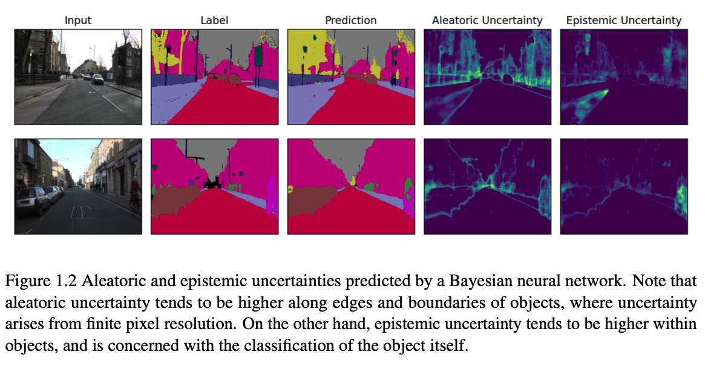
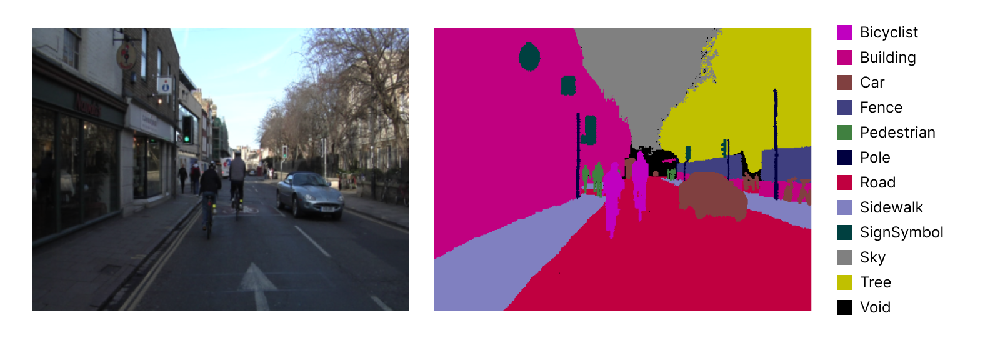
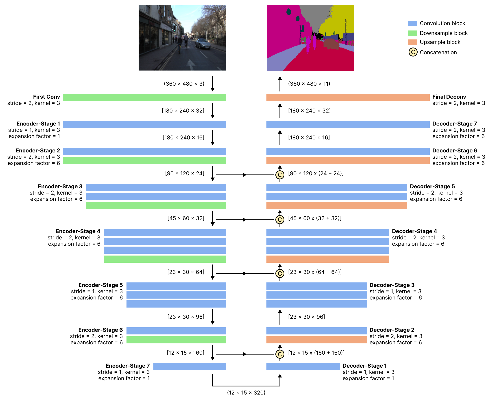
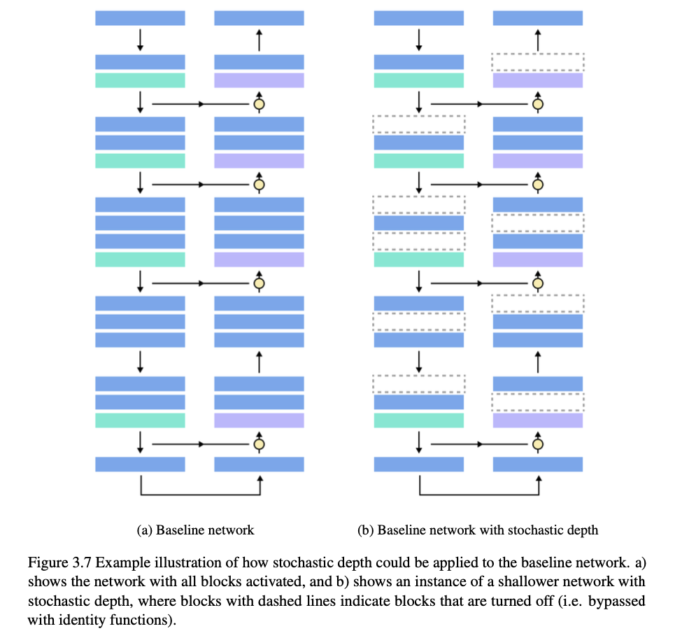
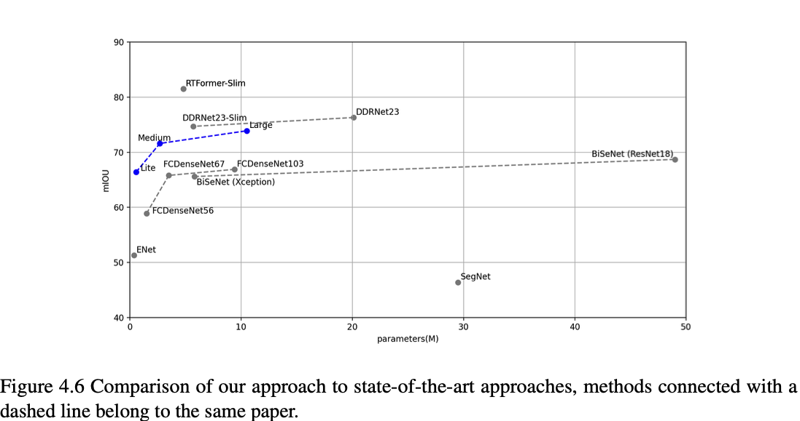
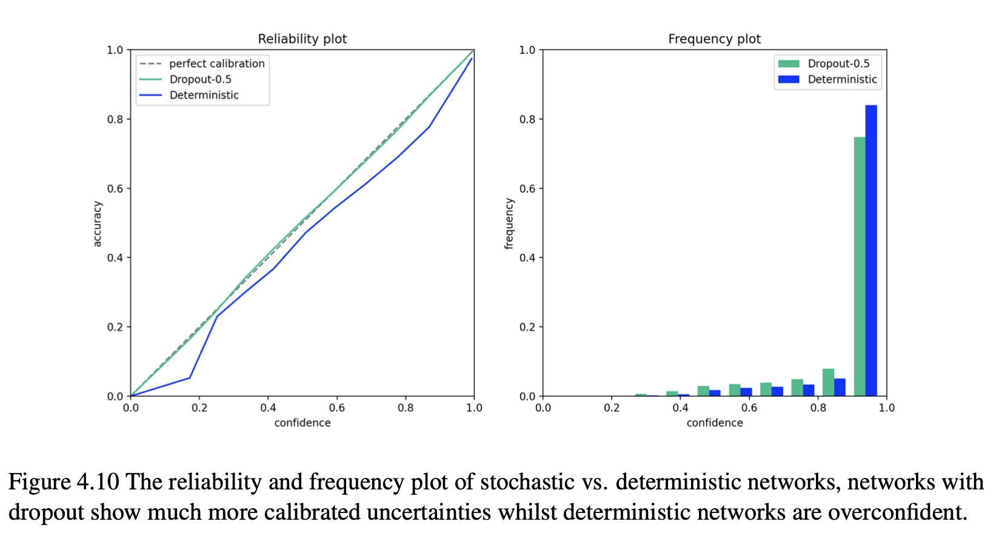

# Leon's MSc Thesis: Efficient Bayesian Neural Networks for Outdoor Semantic Scene Understanding Tasks in Robotics

The full thesis can be viewed [here](https://www.leonyao.net/pdfs/MSc_Thesis_LeonYao.pdf).

## Problem



Deep neural networks often suffer from overconfidence and slow computation. My thesis focused on two aspects:

1. making networks more efficient (i.e. faster inference speed)
2. perform Bayesian inference on these networks

### Dataset

Camvid dataset: `367`, `101`, and `233` train, val, test images respectively, trained and tested with resolution `480 x 360`. You can download the dataset from here: https://www.kaggle.com/datasets/carlolepelaars/camvid.



## Methodology

The segmentation network is built using inverted residual blocks, with symmetrical encoder-decoder.



<!-- Bayesian inference: stochastic depth -->

A novel Bayesian inference technique is proposed using stochastic depths.



### Bayesian forward pass

A bayesian neural network wrapper class `Bayesian_net` is used to set and toggle the dropout and stochastic depth layers, essentially overwriting the default `model.eval()` for certain layers. The bayesian forward pass is computed as follows:

$$
p(y=c|x, \mathcal{D}) \approx \frac{1}{D}\sum^{T}_{i=1}p(y=c|x, w_t)
$$

where $w_t$ represents an instance of a realised weight tensor, and $p(y=c|x, \mathcal{D})$ is the softmax probability for class $c$ outputted by the network with stochastic regularization.

## Results

### Network architecture variations

A set of network variations were tried better understand the encoder-decoder architecture.


- _no-skip_: remove skip connections between the encoder and decoder
- _upsample-skip_: add skip connection everytime the network upsamples
- _dense-skip_: every encoder is connected to a decoder
- _add-skip_: use the add operation instead of concatenating

### Comparison to state-of-the-art



### Uncertainties
The Bayesian networks trained with stochastic regularization achieves much more calibrated uncertainties. 



If you find this work useful and use it in your work, please cite it as follow:

```
@article{yao2023msc,
  title   = "Efficient Bayesian Neural Networks for Outdoor Semantic Scene Understanding Tasks in Robotics",
  author  = "Yao, Linghong",
  journal = "leonyao.net",
  year    = "2023",
  month   = "Sep",
  url     = "https://www.leonyao.net/projects/msc"
}
```
